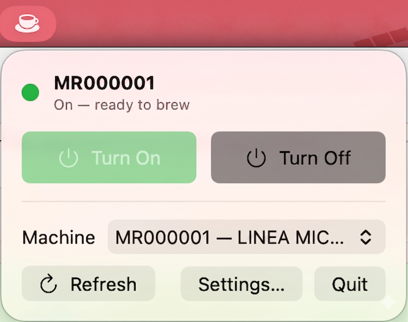

# ☕ Pronto

**Turn your La Marzocco espresso machine on and off right from your Mac's menu bar.**

<p align="center">
  
</p>

Pronto adds a little coffee-cup icon to the top of your screen. Click it to switch
your machine **on** (so it's warm and ready) or **off** — no need to walk over to
it or open an app on your phone.

Works with the **La Marzocco Linea Micra**, **Linea Mini**, and **GS3**.

---

## Install

**Homebrew** (recommended — updates via `brew upgrade`):

```sh
brew install --cask pacificsky/tap/pronto
```

**Or manually:**

1. **[Download the latest version here](https://github.com/pacificsky/pronto/releases/latest)**
   (grab the file ending in `.zip`).
2. Open the downloaded file to unzip it, then drag **Pronto** into your
   **Applications** folder.
3. Double-click **Pronto** to open it. (It's signed with an Apple Developer ID and
   notarized by Apple, so it opens with no security warnings.)

Then click the coffee-cup icon in your menu bar → **Settings…** and sign in with
the **same email and password you use in the official La Marzocco app**.

That's it! Pick your machine and you'll see **Turn On** / **Turn Off** buttons.

## Using Pronto

- Click the cup icon any time to turn your machine on or off.
- The menu-bar icon changes shape, and a colored dot in the popover shows whether your machine is currently on.
- Have more than one machine? Choose which one from the menu.

## Good to know

- **Your Mac needs macOS 14 or newer.**
- **Your login stays private.** Your La Marzocco email and password are saved
  securely in your Mac's Keychain and are only ever sent to La Marzocco to
  control your machine.
- Pronto talks to your machine through La Marzocco's online service, so your Mac
  needs an internet connection (it doesn't have to be on the same Wi-Fi as the
  machine).

## Tested on

Pronto has been validated end-to-end on a **Linea Micra** paired with a **Pico**
grinder.

It *should* work with the other supported machines (**Linea Mini**, **GS3**) and
grinders, but those haven't been verified on real hardware yet. If you own one,
please give Pronto a try — and if something doesn't work,
[open an issue](https://github.com/pacificsky/pronto/issues) with what you saw
(or send a patch). Your feedback is what makes broader support possible.

---

> **Unofficial app.** Pronto is not affiliated with, endorsed by, or sponsored by
> La Marzocco S.r.l. "La Marzocco", "Linea Micra", and "Linea Mini" are
> trademarks of their respective owner, used here only to describe what Pronto
> works with.

---

### For developers

Want to build it yourself, understand how it works, or publish a new version?

- 🛠️ **[Developer Guide](DEVELOPER-GUIDE.md)** — build from source, architecture, how the La Marzocco connection works.
- 🚀 **[Release Guide](RELEASE.md)** — how to cut a new release.
